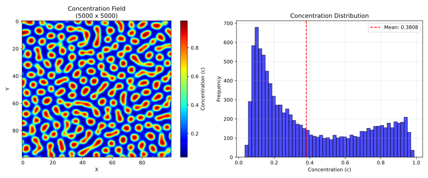
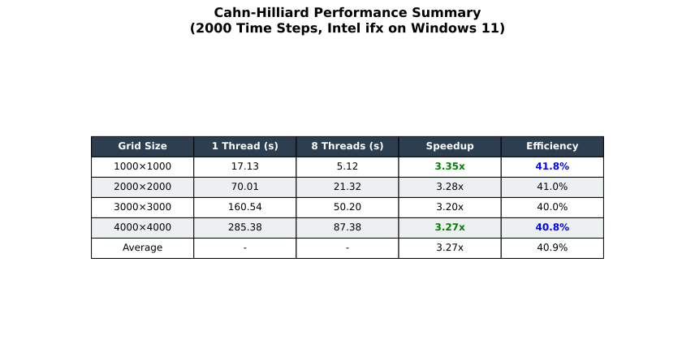
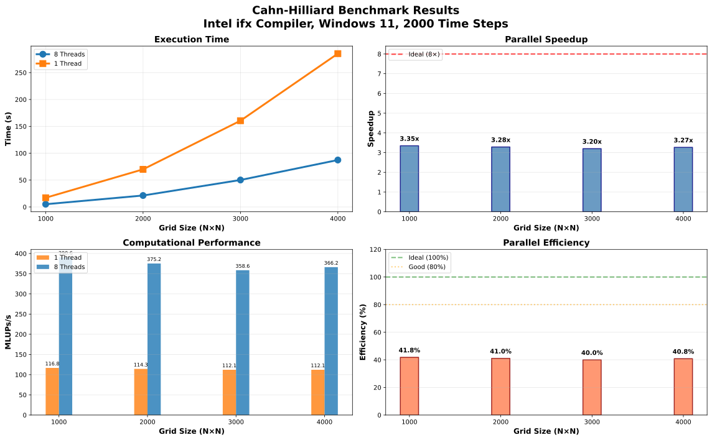
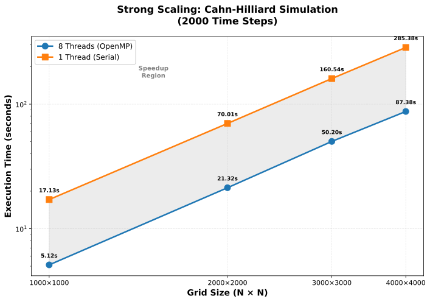
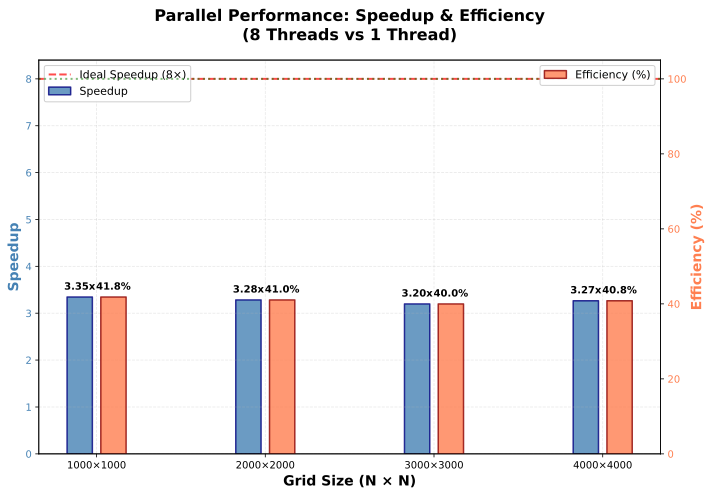
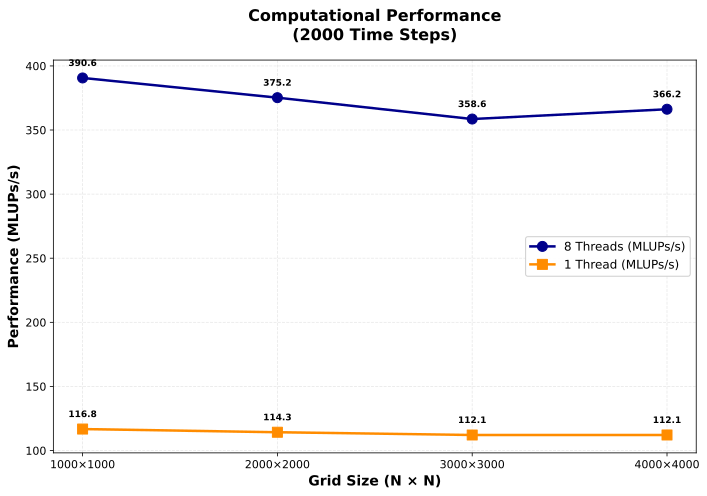

## Numerical Model

It solves the classical **Cahn–Hilliard Equation**:

```math
\frac{\partial c}{\partial t}
=
\nabla \cdot
\left(
M \nabla \mu
\right)
```

where chemical potential is:

```math
\mu =
\frac{\partial f(c)}{\partial c}
-
\kappa \nabla^2 c
```
Applications include simulation of:

* Binary alloy decomposition
* Interface evolution
* Phase separation kinetics
* Domain coarsening

## Project Structure

```text
CahnHilliard/
│
├── app/
│   └── main_driver.f90
│
├── src/
│   ├── precisions_control.f90
│   ├── error_handler.f90
│   ├── performance_timer.f90
│   ├── core_utilities.f90
│   ├── phase_field_solver.f90
│   ├── phase_field_setup.f90
│   ├── grid_generator.f90
│   ├── microstructure_initializer.f90
│   ├── free_energy_kernel.f90
│   ├── laplacian_kernel.f90
│   ├── time_kernel.f90
│   ├── io_handlers.f90
│   ├── performance_analyzer.f90
│   └── performance_evaluation.f90
│
├── visualization/
│   └── python read_binary_ch.py
│
├── scripts/
│   ├── build_windows.ps1
|   ├── build_mingw.bat
│   └── build_linux.sh
│
├── CMakeLists.txt
│
└── README.md
```

# Build Instructions

## Linux / Ubuntu / WSL

Create build directory:
```
mkdir build
cd build
```
Configure project:

```
cmake ..
```
Compile:
```
make -j
```
Run:
```
./bin/cahn_hilliard_driver
```
## Windows Powershell

```
>cd model_b\build
./build_windows.ps1
```

```
cd bin
./cahn_hilliard_driver
```

```
  |==================================================================|
  |                                                                  |
  |                    ---    ---    ---                             |
  |                   |   |  |   |  |   |                            |
  |                   |   |  |   |  |   |                            |
  |                    ---    ---    ---                             |
  |                    ---    ---    ---                             |
  |                   |   |  |   |  |   |                            |
  |                   |   |  |   |  |   |                            |
  |                    ---    ---    ---                             |
  |                                                                  |
  |             Cahn-Hilliard Phase-Field Simulation Suite           |
  |                     High-Performance Computing                   |
  |                                                                  |
  |            Version 1.0.0   |   Author: Shahid Maqbool            |
  |       Date: 16 June 2026   |   License: MIT                      |
  |                                                                  |
  |                                                                  |
  |==================================================================|


 --------------------------
   INITIALIZATION
 --------------------------


 --------------------------
   RUNTIME CONFIGURATION
 --------------------------


  Compiler       : GCC version 15.2.0
  Compiler flags : -cpp -iprefix C:/Users/Shahid/gcc/bin/../lib/gcc/x86_64-w64-mingw32/15.2.0/ -D_MT -D_REENTRANT -U_REENTRANT -D USE_OPENMP -march=skylake -mmmx -mpopcnt -msse -msse2 -msse3 -mssse3 -msse4.1 -msse4.2 -mavx -mavx2 -mno-sse4a -mno-fma4 -mno-xop -mfma -mno-avx512f -mbmi -mbmi2 -maes -mpclmul -mno-avx512vl -mno-avx512bw -mno-avx512dq -mno-avx512cd -mno-avx512vbmi -mno-avx512ifma -mno-avx512vpopcntdq -mno-avx512vbmi2 -mno-gfni -mno-vpclmulqdq -mno-avx512vnni -mno-avx512bitalg -mno-avx512bf16 -mno-avx512vp2intersect -mno-3dnow -madx -mabm -mno-cldemote -mclflushopt -mno-clwb -mno-clzero -mcx16 -mno-enqcmd -mf16c -mfsgsbase -mfxsr -mno-hle -msahf -mno-lwp -mlzcnt -mmovbe -mno-movdir64b -mno-movdiri -mno-mwaitx -mno-pconfig -mno-pku -mprfchw -mno-ptwrite -mno-rdpid -mrdrnd -mrdseed -mno-rtm -mno-serialize -mno-sgx -mno-sha -mno-shstk -mno-tbm -mno-tsxldtrk -mno-vaes -mno-waitpkg -mno-wbnoinvd -mxsave -mxsavec -mxsaveopt -mxsaves -mno-amx-tile -mno-amx-int8 -mno-amx-bf16 -mno-uintr -mno-hreset -mno-kl -mno-widekl -mno-avxvnni -mno-avx512fp16 -mno-avxifma -mno-avxvnniint8 -mno-avxneconvert -mno-cmpccxadd -mno-amx-fp16 -mno-prefetchi -mno-raoint -mno-amx-complex -mno-avxvnniint16 -mno-sm3 -mno-sha512 -mno-sm4 -mno-apxf -mno-usermsr -mno-avx10.2 -mno-amx-avx512 -mno-amx-tf32 -mno-amx-transpose -mno-amx-fp8 -mno-movrs -mno-amx-movrs --param=l1-cache-size=32 --param=l1-cache-line-size=64 --param=l2-cache-size=8192 -mtune=skylake -mthreads -O3 -O3 -Wall -Wextra -Wimplicit-interface -ffree-line-length-none -funroll-loops -ftree-vectorize -fstack-arrays -fopenmp -J modules
  ==================================================
  OpenMP threads : 8
  CPU cores      : 8
  Parallel mode  : ENABLED
  Precision      : Single (r_sp = 4)
  Memory model   : dynamic allocation
  Output unit    : 6


 --------------------------
   GRID SETUP
 --------------------------


 -----------------------------------------
 Enter grid dimensions
 Press Enter to use default values
 -----------------------------------------
 Enter Nx (positive integer, default 500):

 Using default Nx =          500
 Enter Ny (positive integer, default 500):

 Using default Ny =          500

 |======================================================|
 |            ALLOCATION STATUS CHECK                   |
 |======================================================|
 |                                                      |
 |     SUCCESS: Memory allocation successful!           |
 |    Status code    :            0                     |
 |                                                      |
 |    All arrays have been allocated and initialized.   |
 |    Ready for simulation.                             |
 |                                                      |
 |======================================================|
 =========================================
 Grid created successfully!
   Nx =          500
   Ny =          500
 =========================================


 --------------------------
   MICROSTRUCTURE INITIALIZATION
 --------------------------


  c0     :   0.4000
  noise  :   0.0200

 Initial microstructure generated

  |======================================================================|
  |                                                                      |
  |   OpenMP: ENABLED  |  Threads: 8  |  Parallel execution              |
  |                                                                      |
  |   Starting Cahn-Hilliard Microstructure Evolution                    |
  |                                                                      |
  |======================================================================|

  Timer started...

  Progress:

  Progress ||||||||||||||||||||||||||||||||||||||||||||||||||||||||||||||||||||||||||||||||||||||||||||||||||||||   5%   [    0.28s elapsed]
  Progress ||||||||||||||||||||||||||||||||||||||||||||||||||||||||||||||||||||||||||||||||||||||||||||||||||||||  10%   [    0.58s elapsed]
  Progress ||||||||||||||||||||||||||||||||||||||||||||||||||||||||||||||||||||||||||||||||||||||||||||||||||||||  15%   [    0.91s elapsed]
  Progress ||||||||||||||||||||||||||||||||||||||||||||||||||||||||||||||||||||||||||||||||||||||||||||||||||||||  20%   [    1.23s elapsed]
  Progress ||||||||||||||||||||||||||||||||||||||||||||||||||||||||||||||||||||||||||||||||||||||||||||||||||||||  25%   [    1.51s elapsed]
  Progress ||||||||||||||||||||||||||||||||||||||||||||||||||||||||||||||||||||||||||||||||||||||||||||||||||||||  30%   [    1.84s elapsed]
  Progress ||||||||||||||||||||||||||||||||||||||||||||||||||||||||||||||||||||||||||||||||||||||||||||||||||||||  35%   [    2.12s elapsed]
  Progress ||||||||||||||||||||||||||||||||||||||||||||||||||||||||||||||||||||||||||||||||||||||||||||||||||||||  40%   [    2.44s elapsed]
  Progress ||||||||||||||||||||||||||||||||||||||||||||||||||||||||||||||||||||||||||||||||||||||||||||||||||||||  45%   [    2.77s elapsed]
  Progress ||||||||||||||||||||||||||||||||||||||||||||||||||||||||||||||||||||||||||||||||||||||||||||||||||||||  50%   [    3.11s elapsed]
  Progress ||||||||||||||||||||||||||||||||||||||||||||||||||||||||||||||||||||||||||||||||||||||||||||||||||||||  55%   [    3.42s elapsed]
  Progress ||||||||||||||||||||||||||||||||||||||||||||||||||||||||||||||||||||||||||||||||||||||||||||||||||||||  60%   [    3.75s elapsed]
  Progress ||||||||||||||||||||||||||||||||||||||||||||||||||||||||||||||||||||||||||||||||||||||||||||||||||||||  65%   [    4.06s elapsed]
  Progress ||||||||||||||||||||||||||||||||||||||||||||||||||||||||||||||||||||||||||||||||||||||||||||||||||||||  70%   [    4.38s elapsed]
  Progress ||||||||||||||||||||||||||||||||||||||||||||||||||||||||||||||||||||||||||||||||||||||||||||||||||||||  75%   [    4.70s elapsed]
  Progress ||||||||||||||||||||||||||||||||||||||||||||||||||||||||||||||||||||||||||||||||||||||||||||||||||||||  80%   [    5.03s elapsed]
  Progress ||||||||||||||||||||||||||||||||||||||||||||||||||||||||||||||||||||||||||||||||||||||||||||||||||||||  85%   [    5.34s elapsed]
  Progress ||||||||||||||||||||||||||||||||||||||||||||||||||||||||||||||||||||||||||||||||||||||||||||||||||||||  90%   [    5.67s elapsed]
  Progress ||||||||||||||||||||||||||||||||||||||||||||||||||||||||||||||||||||||||||||||||||||||||||||||||||||||  95%   [    5.95s elapsed]
  Progress |||||||||||||||||||||||||||||||||||||||||||||||||||||||||||||||||||||||||||||||||||||||||||||||||||||| 100%
  [    6.26s elapsed]
  Progress |||||||||||||||||||||| 100%

    Timer stopped...

  |======================================================================|
  |                         TIMING REPORT                                |
  |======================================================================|

  Timing Results:
  =======================================================================
    SYSTEM_CLOCK  :        6.265 seconds
    OMP_GET_WTIME :        6.265 seconds

    Primary timer : OMP_GET_WTIME (parallel)
  ========================================================================


 --------------------------
   WRITING OUTPUT
 --------------------------


   +----------------------------------------------------------------------+
   |                         OUTPUT RESULTS                               |
   +----------------------------------------------------------------------+
   |                                                                      |
   |    Grid size      :    500 x    500                                  |
   |    Total points   :       250000                                     |
   |    Statistics     : min =   0.0013, mean =   0.3990, max =   0.9957  |
   |                                                                      |
   |    Concentration Sample (first            5 x           5 ):         |
   |                                                                      |
   |        0.039357  0.075168  0.251463  0.730870  0.894749              |
   |        0.021570  0.053623  0.238815  0.773649  0.943977              |
   |        0.040764  0.067021  0.261927  0.787754  0.943232              |
   |        0.139653  0.126386  0.303845  0.751630  0.876536              |
   |        0.462008  0.297326  0.335390  0.570409  0.611333              |
   |                                                                      |
   |    Format         : BINARY (32-bit floats)                           |
   +----------------------------------------------------------------------+

   +----------------------------------------------------------------------+
   |                    BINARY OUTPUT SUCCESSFUL
   +----------------------------------------------------------------------+
   |    File           : ch.dat                                           |
   |    Points written :       250000                                     |
   |    File size      :       976.59 KB                                  |
   |    Format         : BINARY (stream access)                           |
   +----------------------------------------------------------------------+


 --------------------------
   PERFORMANCE ANALYSIS
 --------------------------


 DEBUG: calculate_performance_metrics

  |=====================================================================|
  |                    OPENMP PERFORMANCE REPORT                        |
  |=====================================================================|
  System Configuration:
  ====================================================================
    Available CPU cores : 8
    OpenMP threads      : 8
    Grid size           : 500 x 500
    Time steps          : 2000
    Total updates       :       500000000

  Timing Results:
  =====================================================================
    System Clock       :        6.265 seconds
    Wall Time (elapsed):        6.265 seconds


  |======================================================================|
  |                                                                      |
  |                         SIMULATION COMPLETE                          |
  |                                                                      |
  |   Total execution time :       6.2650 seconds                        |
  |                                                                      |
  |            All results written successfully                          |
  |                                                                      |
  |======================================================================|
```


# Visualization

```
# cd visualization
python read_binary_ch.py
```

the output

```
╔══════════════════════════════════════════════════════════════════════╗
║                    BINARY OUTPUT READER                              ║
║                         Cahn-Hilliard Output                         ║
╚══════════════════════════════════════════════════════════════════════╝

  Input file  : ch.dat

  Reading binary file...
  ✓ Magic number: 0x12345678
  ✓ Version: 1
  ✓ Grid: 3000 x 3000
  ✓ Precision: single
  ✓ Statistics:
      - Min: 0.010688
      - Max: 0.999990
      - Mean: 0.398489

  Sample Data (first 5x5):
  ════════════════════════════════════════════════════════════════════
    0.743512 0.912787 0.944180 0.898951 0.690801
    0.794297 0.945550 0.973636 0.942055 0.767160
    0.622938 0.821428 0.872484 0.828745 0.619173
    0.254112 0.373314 0.438577 0.392869 0.259260
    0.105799 0.121930 0.139960 0.132291 0.104266

  Generating plot first 100 x 100...
  ✓ Figure saved as: concentration_plot.png

╔══════════════════════════════════════════════════════════════════════╗
║                    READING COMPLETE                                  ║
║    Grid points    : 9000000                                          ║
║                                                                      ║
║    ✓ Data read successfully!                                         ║
╚══════════════════════════════════════════════════════════════════════╝
```


## BENCHMARK SUMMARY




